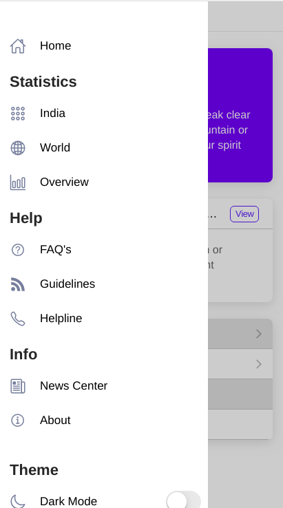
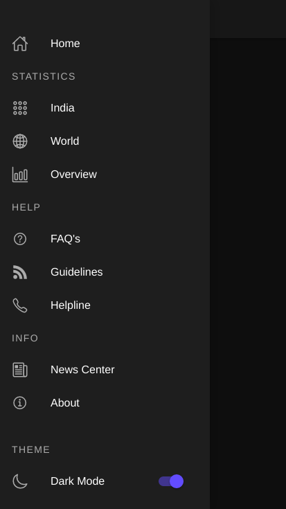

**Some Background** 

> This is a Hybrid App powered with "Ionic Framework" , using "Angular
> 8" as a frontend framework to ensure  Project architecture remains Scalable to meet future needs right from the beginning and the code remains understandable for community to play with !

**Steps to get the App running in browser**

 1. Get into the Project folder by `cd Covid-19-App`
 2. Install all dependencies `npm install`
 3. Run the project in web-browser by `ionic serve`

**Steps to build the App for mobile device**

    For Android: Follow https://ionicframework.com/docs/developing/android	  
                                                                                         
    For iOS : Follow https://ionicframework.com/docs/developing/ios
    
**Screenshots**

&nbsp;&nbsp;&nbsp;&nbsp;

