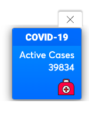

## Run and deploy locally
npm run serverstart

## Include COVID19 plugin on your website

The plugin can be added to your website by including the following to the intended page  

``

`<link rel="stylesheet" href="dashboard_plugin/coronaindia.css" />`
